# Ros2 Docker Mac Network

The objective of this small project is to provide a guideline to create a ros2 network that connects your Mac(osx) with your docker containers. The Mac docker desktop distribution has its own peculiarities and is different to the linux distribution as it doesn't allow to share the network between the host and the docker containers.

In order to create a ros2 network we need the following:

- Install docker-mac-network from [wojas/docker-mac-network](https://github.com/wojas/docker-mac-network) or the [/docker-mac-network](docker-mac-network) folder from this repo. This will allow us to create a docker network called "docker-mac-network" with openvpn and the relevant ovpn configuration that can be used with [Tunnelblick](https://tunnelblick.net/downloads.html) to connect your mac to your docker containers that use the "docker-mac-network"
- Use of [Fast-dds discovery server](https://fast-dds.docs.eprosima.com/en/latest/fastdds/ros2/discovery_server/ros2_discovery_server.html). For that we will need the following environment setup:
  - export RMW_IMPLEMENTATION=rmw_fastrtps_cpp
  - export ROS_DISCOVERY_SERVER="172.25.0.3:11811"
- Use of fast-dds super-client to enable the daemon to perform all the cli operations and allow it to discover all the nodes within the ros2 network. For that we will need the following environment setup:
  -   - export FASTRTPS_DEFAULT_PROFILES_FILE=<PATH_ROS_DOCKER_MAC_NET>/ros2_profiles/super_client_configuration_file.xml
```bash
It has been tested with ros2 "galactic"
```
## Guide To Create the Network and discovery server

#### First time:
- Run the [start.sh](start.sh). This will do the following.
  - Create docker network called docker-mac-network_default with subnet 172.25.0.0/16. This will allow us to set a static IP 172.25.0.3 to the fast-dds discovery server
  - Create the openVPN configuration in case that it doesn't exist. It will also comment "#comp-lzo no" line of the openvpn.conf as the ros2-galactic docker images don´t use comp-lzo. By doing this patching the OSX host will be able to ping the docker images
  - Create the fast-dds discovery server with ip 172.25.0.3
  - stop and start the ros2 daemon
- Double click on docker-for-mac.ovpn to load the configuration in Tunnelblick.
    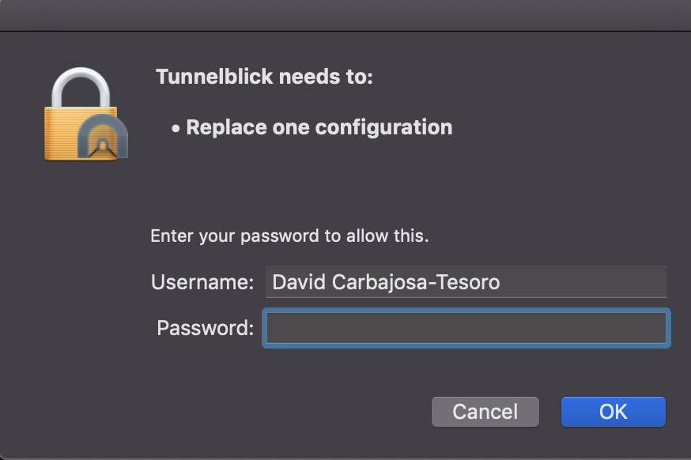

- Connect to the docker-for-mac network

    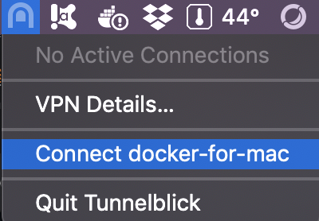

- At this point you should be able to ping the discovery server
  ```bash
  ping 172.25.0.3
  ```
    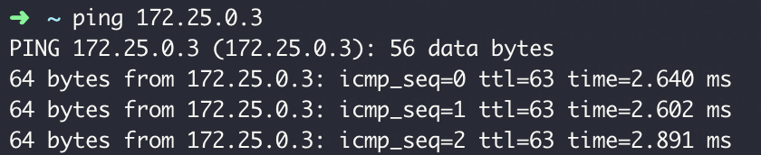

#### Subsequent times:

- Run the [start.sh](start.sh)
- Connect to the docker-for-mac network
- At this point you should be able to ping the discovery server
  ```bash
  ping 172.25.0.3
  ```

## Ros talker-listener demo running on extended network (docker-mac) 

- Spin up two docker containers in different terminals with ros-galactic-desktop distribution - it can be any distribution (core,base, desktop). In the example I´m using one custom distribution with golang installed.
    ```bash
    docker run -ti --net docker-mac-network_default -e RMW_IMPLEMENTATION=rmw_fastrtps_cpp -e ROS_DISCOVERY_SERVER="172.25.0.3:11811" galactic-ros-desktop-go:1.16.2 -- bash
    ```
- Run the listener in each docker container
    ```bash
    ros2 run demo_nodes_cpp listener --ros-args --remap __node:=listener1
    ```
     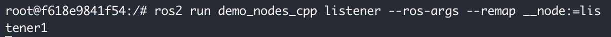

    and 
    ```bash
    ros2 run demo_nodes_cpp listener --ros-args --remap __node:=listener2
    ```
    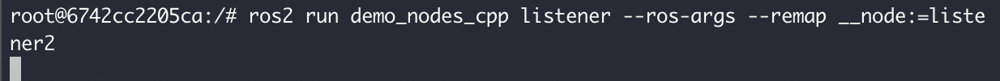

- Run the talker in osx terminal
    ```bash
    ros2 run demo_nodes_cpp talker --ros-args --remap __node:=talker1
    ```
    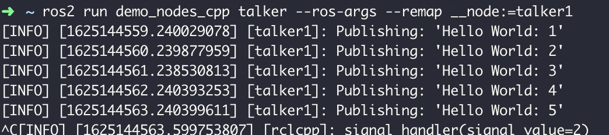

    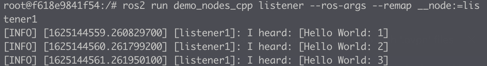

    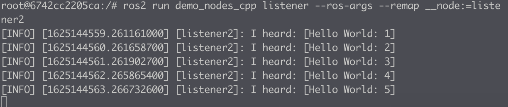

## daemon operations on extended network (docker-mac) 
- List nodes
    ```bash
    ros2 node list
    ```
    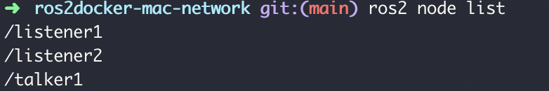

- List topics
    ```bash
    ros2 topic list
    ```
    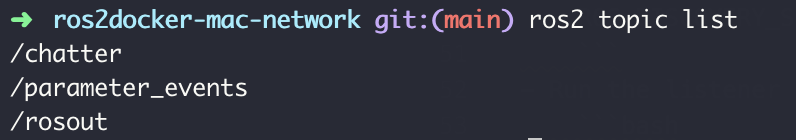

- Get Node info
    ```bash
    ros2 node info /talker1
    ```
    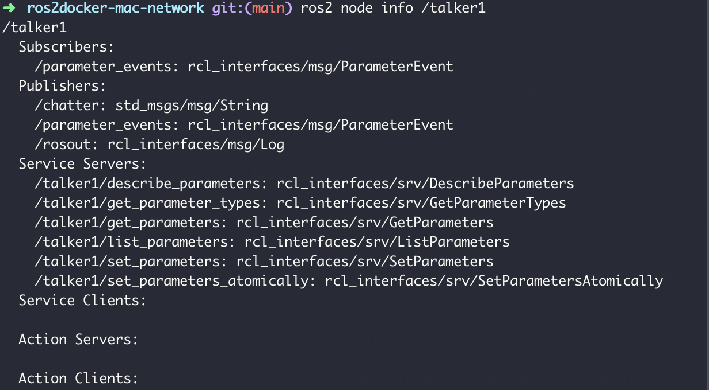
## know issues

It may happen that the daemon doesn't display the information. This might be caused because when we started the terminal the openVPN wasn't connected (usually the first time). In order to solve the issue, stop and start the daemon and back to normal
    ```bash
    ros2 daemon stop
    ros2 daemon start
    ```
    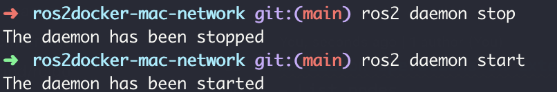

